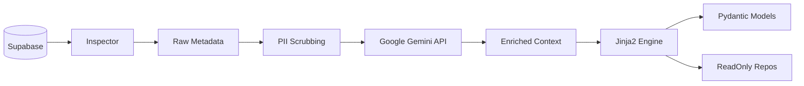

Here is the comprehensive, portfolio-ready **`README.md`** for **Rosetta Bridge**. It reflects the full scope of the architecture we defined in the `spec.md` and aligns with your new stack (Supabase, Gemini, uv).

---

```markdown
# Rosetta Bridge 🌉

> **Bridging the gap between Legacy Data and AI Agents.**

[](https://www.python.org/)
[](https://supabase.com/)
[](https://ai.google.dev/)
[](https://github.com/astral-sh/uv)

**Rosetta Bridge** is a developer tool that automates the integration of legacy SQL databases (specifically Supabase/PostgreSQL) into modern AI Agent architectures.

Instead of manually mapping hundreds of cryptic table names (e.g., `T001_CUST`, `FLG_ACT`) to tool definitions, Rosetta Bridge uses **Google Gemini** to semantically infer business meaning and generate **Type-Safe Pydantic Models** and **Read-Only Repository Layers** in seconds.

---

## 🚀 Key Features

* **🔍 Automated Schema Inspection**: Instantly reflects metadata from Supabase/PostgreSQL using SQLAlchemy.
* **🧠 Semantic Inference**: Uses **Gemini 1.5 Flash** to translate technical column names into human-readable business descriptions.
* **🛡️ Safe-by-Design**: Generates strict **Read-Only** data access layers. The generated code is physically incapable of executing `UPDATE`, `DELETE`, or `DROP` commands, satisfying Enterprise Security requirements.
* **⚡ Type-Safe Artifacts**: Outputs production-ready Python code using **Pydantic v2** (compatible with OpenAI Function Calling).
* **📝 Audit Trails**: Generates a `audit_log.md` for every run, documenting exactly what the AI inferred for compliance reviews.

---

## 🛠️ Tech Stack

* **Core**: Python 3.10+
* **Package Manager**: `uv` (for lightning-fast dependency management)
* **Database**: Supabase (PostgreSQL) + `psycopg2`
* **AI Orchestration**: Google Generative AI (`gemini-1.5-flash`)
* **CLI**: Typer + Rich
* **Templating**: Jinja2

---

## 📦 Installation

This project uses **[uv](https://github.com/astral-sh/uv)** for dependency management.

1.  **Clone the repository**
    ```bash
    git clone [https://github.com/yourusername/rosetta_bridge.git](https://github.com/yourusername/rosetta_bridge.git)
    cd rosetta_bridge
    ```

2.  **Initialize Environment**
    ```bash
    uv sync
    ```

3.  **Configure Credentials**
    Copy the example environment file and add your keys:
    ```bash
    cp .env.example .env
    ```
    * `DATABASE_URL`: Your Supabase connection string (use port 5432 or 6543).
    * `GEMINI_API_KEY`: Your API key from [Google AI Studio](https://aistudio.google.com/).

4.  **Verify Installation**
    ```bash
    uv run rosetta-bridge version
    ```

---

## 📖 Usage

### 1. Initialize Project
Create the default configuration file (`rosetta_map.yaml`) in your working directory.
```bash
uv run rosetta-bridge init

```

### 2. Inspect Schema (Dry Run)

Connect to your database and analyze the tables listed in your config *without* generating code. useful for testing connectivity and PII detection.

```bash
uv run rosetta-bridge inspect

```

### 3. Generate Artifacts

Run the full pipeline: Inspect -> Analyze -> Infer (Gemini) -> Generate Code.

```bash
uv run rosetta-bridge generate

```

**Output:**
The tool will create a `generated/` directory containing:

* `_models.py`: Pydantic data models.
* `_repos.py`: Safe, read-only database functions.
* `audit_log.md`: A summary of the AI's inference.

---

## ⚙️ Configuration (`rosetta_map.yaml`)

Control the scope and safety of the bridge using the configuration file.

```yaml
project_name: "BillingAgent"
database:
  connection_string: "${DATABASE_URL}" # Reads from .env

# 🔒 Mandatory Whitelist: Only these tables will be processed
whitelist_tables:
  - "public.customers"
  - "public.orders"

# 🧠 AI Configuration
llm_config:
  model: "gemini-1.5-flash"
  temperature: 0.0

# 🕵️ Privacy Controls
privacy:
  sample_rows: true       # Sends 3 rows of data to Gemini for better context
  scrub_pii: true         # If True, regex-filters likely PII (Email, SSN) before sending

```

---

## 🏗️ Architecture



---

## 🧪 Development

To run tests:

```bash
uv run pytest

```

---

## 📄 License

MIT

```

```